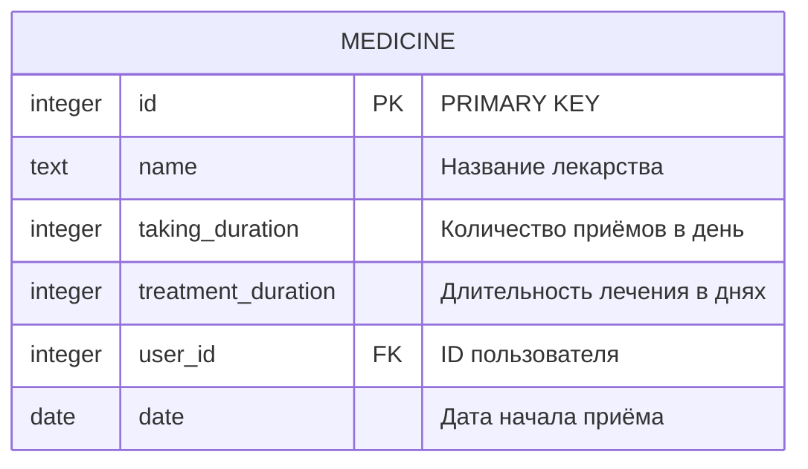

```mermaid
erDiagram
    MEDICINE {
        integer id PK "PRIMARY KEY"
        text name "Название лекарства"
        integer taking_duration "Количество приёмов в день"
        integer treatment_duration "Длительность лечения в днях"
        integer user_id FK "ID пользователя"
        date date "Дата начала приёма"
    }
```