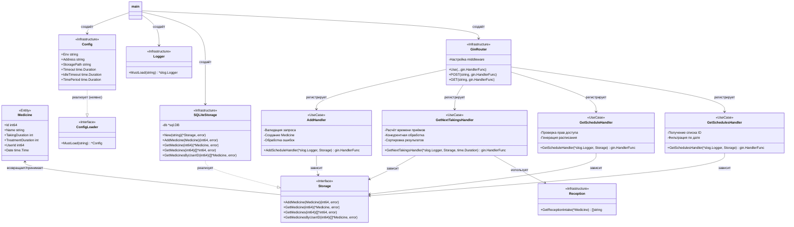

```mermaid
classDiagram
    %%  Уровень Entities
    class Medicine {
        <<Entity>>
        +Id int64
        +Name string
        +TakingDuration int
        +TreatmentDuration int
        +UserId int64
        +Date time.Time
    }

    %%  Уровень Use Cases
    class AddHandler {
        <<UseCase>>
        +AddScheduleHandler(*slog.Logger, Storage) gin.HandlerFunc
        -Валидация запроса
        -Создание Medicine
        -Обработка ошибок
    }

    class GetNextTakingsHandler {
       <<UseCase>>
        +GetNextTakingsHandler(*slog.Logger, Storage, time.Duration) gin.HandlerFunc
        -Расчёт времени приёмов
        -Конкурентная обработка
        -Сортировка результатов
    }

    class GetScheduleHandler {
        <<UseCase>>
        +GetScheduleHandler(*slog.Logger, Storage) gin.HandlerFunc
        -Проверка прав доступа
        -Генерация расписания
    }

    class GetSchedulesHandler {
       <<UseCase>>
        +GetSchedulesHandler(*slog.Logger, Storage) gin.HandlerFunc
        -Получение списка ID
        -Фильтрация по дате
    }

    %% Уровень Interfaces
    class Storage{
        <<Interface>>
        +AddMedicine(Medicine) (int64, error)
        +GetMedicine(int64) (*Medicine, error)
        +GetMedicines(int64) ([]*int64, error)
        +GetMedicinesByUserID(int64) ([]*Medicine, error)
    }

    class ConfigLoader{
        <<Interface>>
        +MustLoad(string) *Config
    }

    %% Уровень Infrastructure
    class SQLiteStorage {
        <<Infrastructure>>
        -db *sql.DB
        +New(string) (*Storage, error)
        +AddMedicine(Medicine) (int64, error)
        +GetMedicine(int64) (*Medicine, error)
        +GetMedicines(int64) ([]*int64, error)
        +GetMedicinesByUserID(int64) ([]*Medicine, error)
    }

    class Logger {
        <<Infrastructure>>
        +MustLoad(string) *slog.Logger
    }

    class GinRouter {
        <<Infrastructure>>
        +Use(...gin.HandlerFunc)
        +POST(string, gin.HandlerFunc)
        +GET(string, gin.HandlerFunc)
        -Настройка middleware
    }

    class Config {
        <<Infrastructure>>
        +Env string
        +Address string
        +StoragePath string
        +Timeout time.Duration
        +IdleTimeout time.Duration
        +TimePeriod time.Duration
    }

    class Reception {
        <<Infrastructure>>
        +GetReceptionIntake(*Medicine) []string
    }

    SQLiteStorage ..|> Storage : реализует
    Config ..|> ConfigLoader : реализует (неявно)

    AddHandler --> Storage : зависит
    GetNextTakingsHandler --> Storage : зависит
    GetScheduleHandler --> Storage : зависит
    GetSchedulesHandler --> Storage : зависит

    GetNextTakingsHandler --> Reception : использует
    Medicine <-- Storage : возвращает/принимает

    GinRouter --> AddHandler : регистрирует
    GinRouter --> GetNextTakingsHandler : регистрирует
    GinRouter --> GetScheduleHandler : регистрирует
    GinRouter --> GetSchedulesHandler : регистрирует

    main --> Config : создаёт
    main --> Logger : создаёт
    main --> SQLiteStorage : создаёт
    main --> GinRouter : создаёт
```