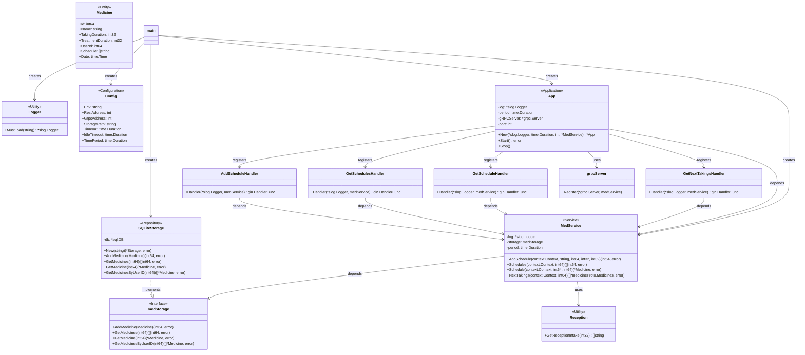

```mermaid
classDiagram
    class Medicine {
        <<Entity>>
        +Id: int64
        +Name: string
        +TakingDuration: int32
        +TreatmentDuration: int32
        +UserId: int64
        +Schedule: []string
        +Date: time.Time
    }

    class MedService {
        <<Service>>
        -log: *slog.Logger
        -storage: medStorage
        -period: time.Duration
        +AddSchedule(context.Context, string, int64, int32, int32) (int64, error)
        +Schedules(context.Context, int64) ([]int64, error)
        +Schedule(context.Context, int64, int64) (*Medicine, error)
        +NextTakings(context.Context, int64) ([]*medicineProto.Medicines, error)
    }

    class medStorage {
        <<Interface>>
        +AddMedicine(Medicine) (int64, error)
        +GetMedicines(int64) ([]int64, error)
        +GetMedicine(int64) (*Medicine, error)
        +GetMedicinesByUserID(int64) ([]*Medicine, error)
    }

    class SQLiteStorage {
        <<Repository>>
        -db: *sql.DB
        +New(string) (*Storage, error)
        +AddMedicine(Medicine) (int64, error)
        +GetMedicines(int64) ([]int64, error)
        +GetMedicine(int64) (*Medicine, error)
        +GetMedicinesByUserID(int64) ([]*Medicine, error)
    }

    class Logger {
        <<Utility>>
        +MustLoad(string) *slog.Logger
    } 
    class Reception {
        <<Utility>>
        +GetReceptionIntake(int32) []string
    }

    class Config {
        <<Configuration>>
        +Env: string
        +RestAddress: int
        +GrpcAddress: int
        +StoragePath: string
        +Timeout: time.Duration
        +IdleTimeout: time.Duration
        +TimePeriod: time.Duration
    }

    class App {
        <<Application>>
        -log: *slog.Logger
        -period: time.Duration
        -gRPCServer: *grpc.Server
        -port: int
        +New(*slog.Logger, time.Duration, int, *MedService) *App
        +Start() error
        +Stop()
    }

class AddScheduleHandler { 
    +Handler(*slog.Logger, medService) gin.HandlerFunc
}

class GetSchedulesHandler {
+Handler(*slog.Logger, medService) gin.HandlerFunc
}

class GetScheduleHandler {
+Handler(*slog.Logger, medService) gin.HandlerFunc
}

class GetNextTakingsHandler {
+Handler(*slog.Logger, medService) gin.HandlerFunc
}

class grpcServer {
+Register(*grpc.Server, medService)
}

SQLiteStorage ..|> medStorage : implements
MedService --> medStorage : depends
MedService --> Reception : uses

AddScheduleHandler --> MedService : depends
GetSchedulesHandler --> MedService : depends
GetScheduleHandler --> MedService : depends
GetNextTakingsHandler --> MedService : depends

App --> MedService : depends
App --> grpcServer : uses

main --> Config : creates
main --> Logger : creates
main --> SQLiteStorage : creates
main --> MedService : creates
main --> App : creates
App --> AddScheduleHandler : registers
App --> GetSchedulesHandler : registers
App --> GetScheduleHandler : registers
App --> GetNextTakingsHandler : registers
```